# 管理者向け利用マニュアル

このマニュアルは、イベントスタッフポータルの管理者向けの操作手順を説明します。管理者はコンテンツの登録・編集・削除、ユーザー管理、アクセスコード管理が行えます。

---

## 目次

1. [ログイン](#1-ログイン)
2. [ダッシュボード](#2-ダッシュボード)
3. [アカウント登録](#3-アカウント登録)
4. [アクセスコード管理](#4-アクセスコード管理)
5. [コンテンツ管理（会期選択）](#5-コンテンツ管理会期選択)
6. [タイムテーブル管理](#6-タイムテーブル管理)
7. [部屋割り管理](#7-部屋割り管理)
8. [部署管理](#8-部署管理)
9. [企画一覧管理](#9-企画一覧管理)
10. [販売物管理](#10-販売物管理)
11. [情報管理](#11-情報管理)
12. [ユーザー管理](#12-ユーザー管理)
13. [パスワード変更](#13-パスワード変更)
14. [ログアウト](#14-ログアウト)

---

## 1. ログイン

管理者はメールアドレスとパスワードでログインします。

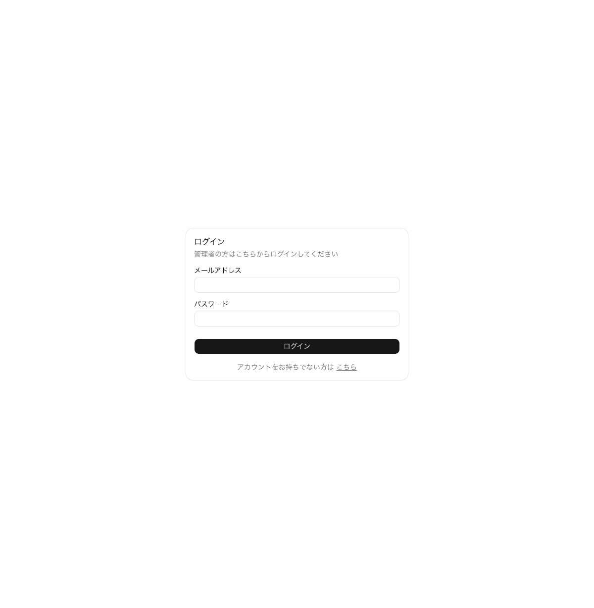

### 手順

1. `https://reitaisai.info/login` にアクセスします
2. メールアドレスとパスワードを入力します
3. 「ログイン」ボタンをクリックします
4. 認証成功後、ダッシュボードに遷移します

> **注意:** ログインページは管理者専用です。一般スタッフはアクセスコード（`/access`）からアクセスします。

---

## 2. ダッシュボード

ログイン後はダッシュボードが表示されます。

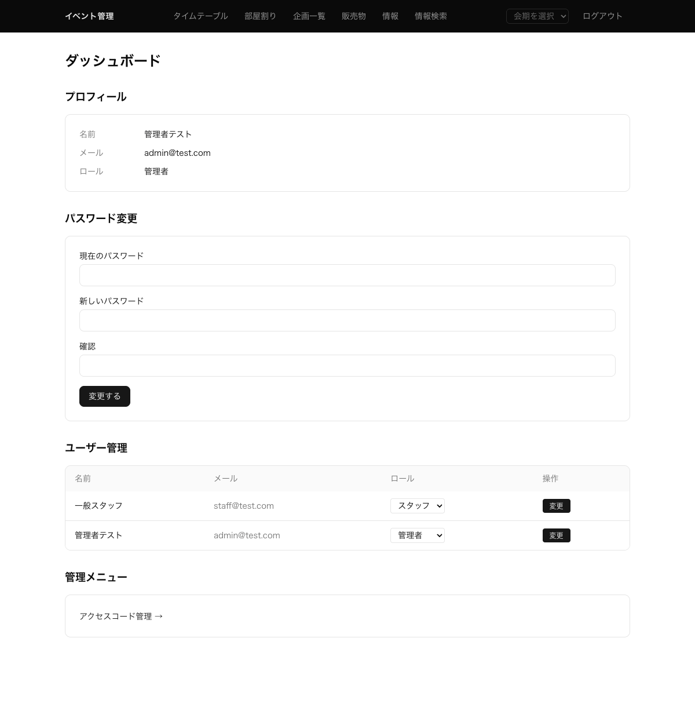

ダッシュボードには以下のセクションがあります：

- **プロフィール:** 自分のアカウント情報（名前・メール・ロール）
- **パスワード変更:** パスワードの変更フォーム
- **ユーザー管理:** 全ユーザーのロール変更（管理者のみ表示）
- **管理メニュー:** アクセスコード管理へのリンク（管理者のみ表示）

---

## 3. アカウント登録

新しいスタッフアカウントを作成する場合は、登録ページを使用します。

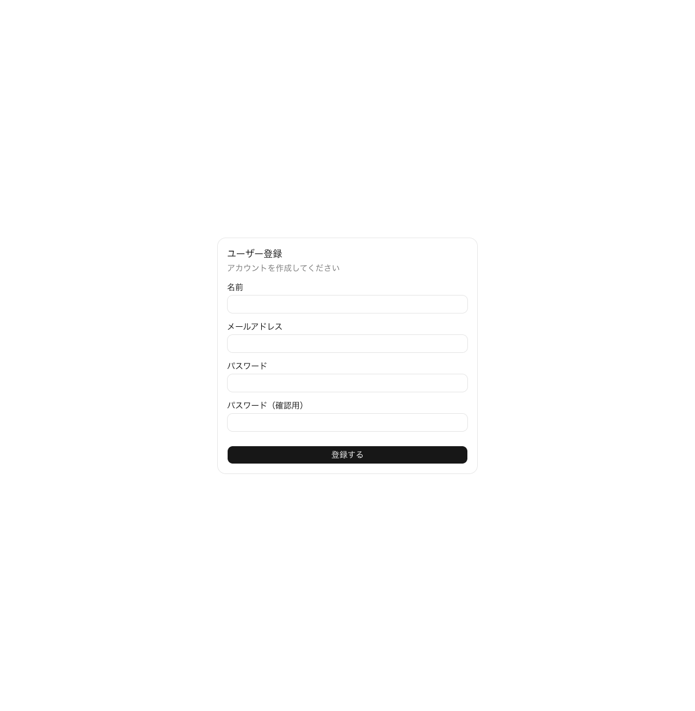

1. `https://reitaisai.info/register` にアクセスします
2. 名前・メールアドレス・パスワード・パスワード（確認用）を入力します
3. 「登録する」ボタンをクリックします

登録後、管理者がダッシュボードからそのユーザーのロールを「管理者」に変更できます。

---

## 4. アクセスコード管理

イベントスタッフが使用するアクセスコードを管理します。

### アクセス方法

ダッシュボードの「管理メニュー」→「アクセスコード管理 →」をクリック

### アクセスコード一覧

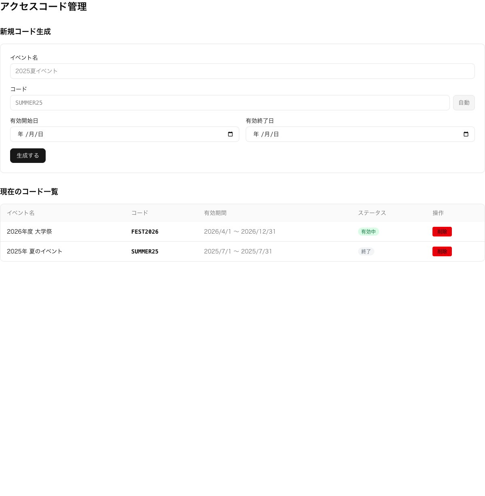

各コードには以下の情報が表示されます：

| 項目 | 説明 |
|------|------|
| イベント名 | コードに紐づくイベント名 |
| コード | スタッフが入力するコード文字列 |
| 有効期間 | 開始日〜終了日 |
| ステータス | 有効中 / 終了 / 準備中 |
| 操作 | 削除ボタン |

### 新規コードの生成

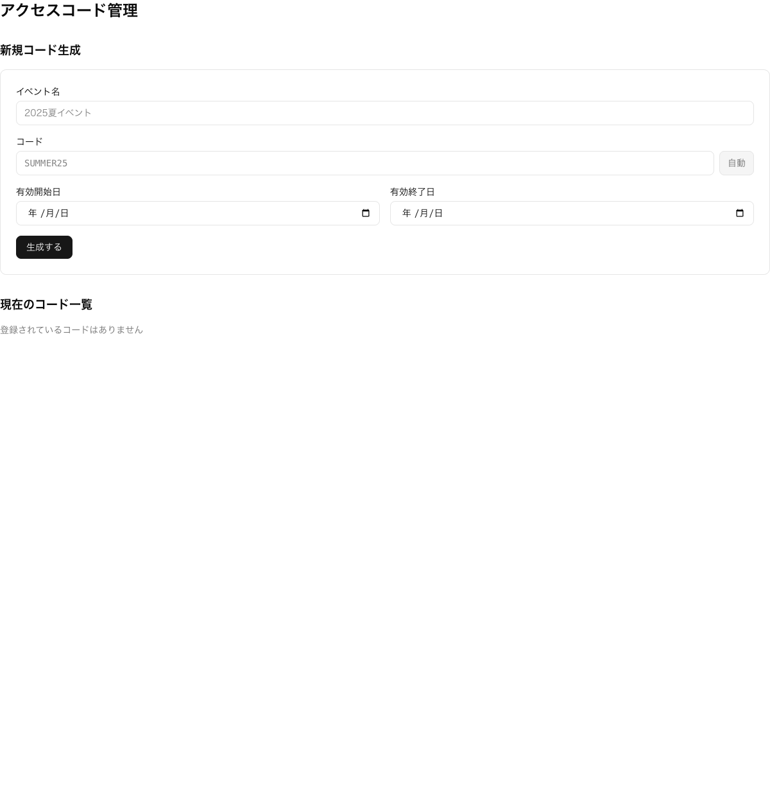

1. 「イベント名」を入力します（例: `2026年度 大学祭`）
2. 「コード」を入力します（例: `FEST2026`）
   - 「自動」ボタンをクリックすると8文字のランダムコードが生成されます
   - コードは大文字英数字のみ使用可能です
3. 「有効開始日」と「有効終了日」を選択します
4. 「生成する」ボタンをクリックします

> **注意:** 有効終了日は開始日より後の日付を設定してください。

### コードの削除

一覧の「削除」ボタンをクリックすると確認ダイアログが表示され、「OK」で削除されます。

---

## 5. コンテンツ管理（会期選択）

コンテンツ（タイムテーブル・部屋割り・企画・販売物・情報）を管理するには、まずナビゲーションバーの **「会期を選択」** プルダウンから対象のイベントを選択します。

イベントを選択すると、各ページが管理者向けの編集モードに切り替わります。

---

## 6. タイムテーブル管理

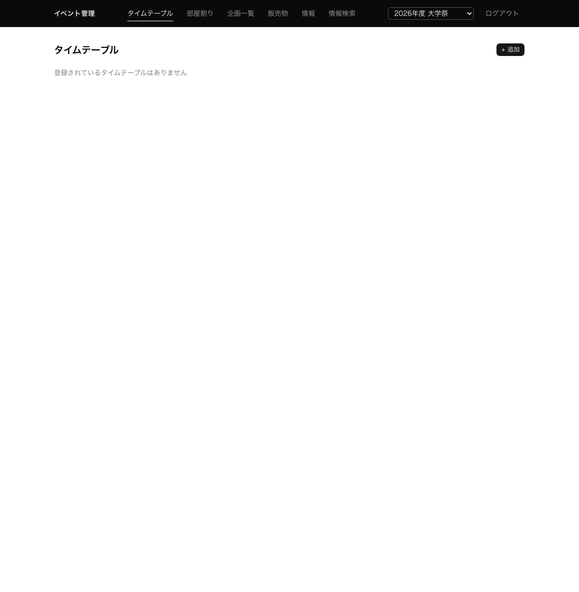

### 新規追加

1. 「+ 追加」ボタンをクリックします

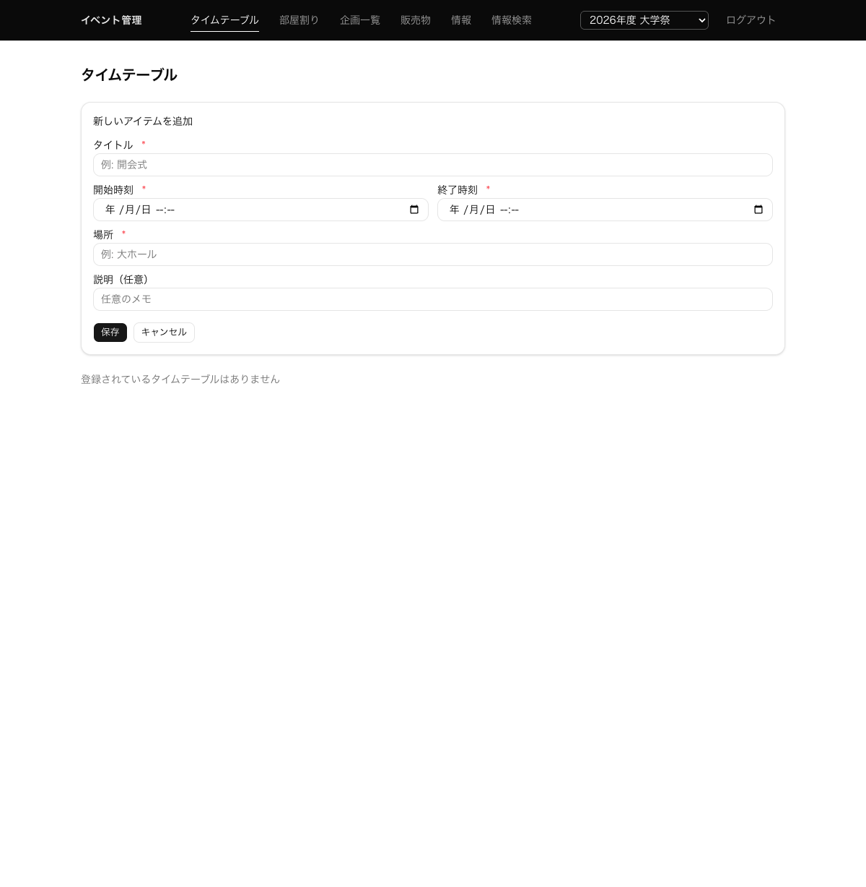

2. 以下の項目を入力します：
   - **タイトル**（必須）: スケジュールの名称（例: `開会式`）
   - **開始時刻**（必須）: 日時を選択
   - **場所**（必須）: 開催場所（例: `大ホール`）
   - **説明**（任意）: 補足メモ

3. 「保存」ボタンをクリックします

### 編集・削除

登録済みのアイテムには「編集」「削除」ボタンが表示されます。

---

## 7. 部屋割り管理

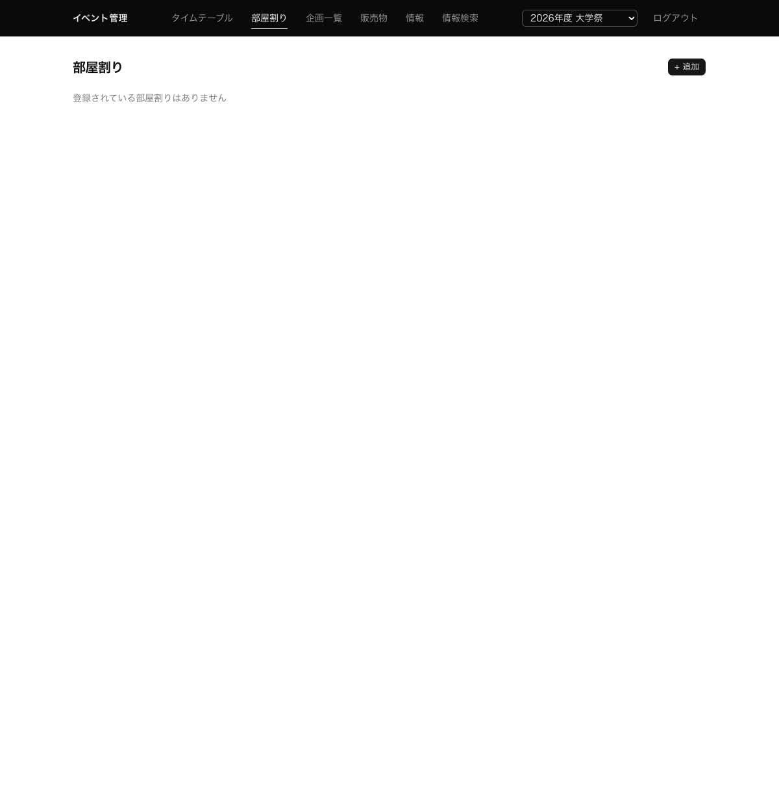

### 新規追加

「+ 追加」ボタンをクリックし、以下の項目を入力します：

- 建物名（必須）
- フロア（必須）
- 部屋名（必須）
- 前日担当部署・用途（任意）
- 当日担当部署（必須）
- 当日用途（必須）
- 備考（任意）

---

## 8. 部署管理

「管理メニュー」の **部署管理** から、会期ごとの部署一覧を管理できます。

### 新規追加

1. 会期を選択した状態で「+ 追加」をクリックします
2. 部署名を入力して「保存」をクリックします

### 編集・削除

- 各部署行の「編集」から名前を更新できます
- 「削除」で部署を削除できます
- 部屋割りで利用中の部署は削除できません（エラー表示）

---

## 9. 企画一覧管理

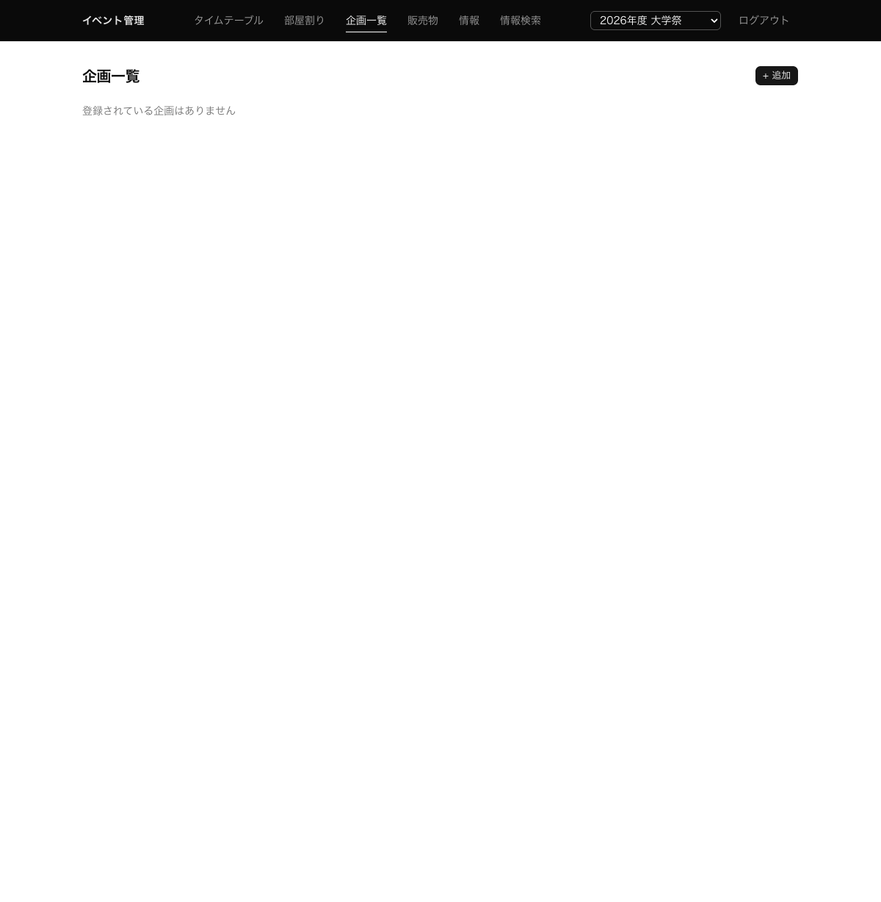

### 新規追加

「+ 追加」ボタンをクリックし、以下の項目を入力します：

- 企画名（必須）
- 場所（必須）
- 開始時刻・終了時刻（必須）
- 説明（任意）

---

## 10. 販売物管理

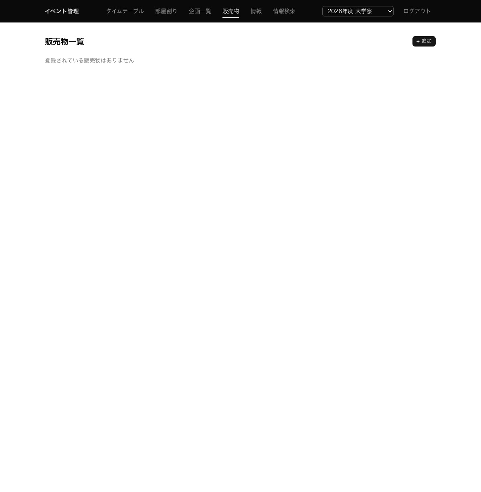

### 新規追加

「+ 追加」ボタンをクリックし、以下の項目を入力します：

- 商品名（必須）
- 価格（必須、円単位）
- 説明（任意）
- 商品画像（必須）

---

## 11. 情報管理

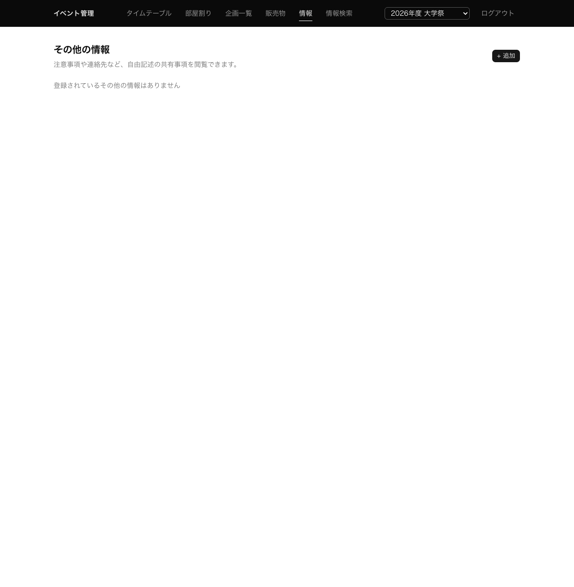

注意事項・連絡先などの自由記述情報を管理します。

### 新規追加

「+ 追加」ボタンをクリックし、以下の項目を入力します：

- タイトル（必須）
- 内容（必須）
- 表示順（必須）: 数値が小さいほど上位に表示
- 画像（任意）

---

## 12. ユーザー管理

ダッシュボードの「ユーザー管理」セクションで全ユーザーのロールを変更できます。

### ロールの変更

1. 変更したいユーザーの行のプルダウンから新しいロールを選択します
   - **スタッフ**: 通常のスタッフアカウント（コンテンツの閲覧のみ）
   - **管理者**: 全ての管理機能が使用可能
2. 「変更」ボタンをクリックします

> **注意:** 自分自身のロールを変更すると管理機能を失う可能性があります。操作は慎重に行ってください。

---

## 13. パスワード変更

ダッシュボードの「パスワード変更」セクションから自分のパスワードを変更できます。

### 手順

1. 「現在のパスワード」を入力します
2. 「新しいパスワード」を入力します（8文字以上）
3. 「確認」に新しいパスワードを再入力します
4. 「変更する」ボタンをクリックします

---

## 14. ログアウト

ナビゲーションバー右上の「ログアウト」ボタンをクリックすると、セッションが終了しログイン画面に戻ります。

---

## よくある質問

**Q: コンテンツ管理ページが見えない場合は？**
A: ナビゲーションバーの「会期を選択」プルダウンで対象のイベントを選択してください。

**Q: アクセスコードのステータスが「終了」になっている場合は？**
A: 有効期間が過去のコードです。新しい有効期間のコードを生成してください。

**Q: 新しいスタッフを管理者にするには？**
A: スタッフにアカウントを登録させた後、ダッシュボードのユーザー管理でロールを「管理者」に変更してください。

**Q: コードを削除してしまった場合は？**
A: 同じコード文字列で新しいコードを再生成してください。
