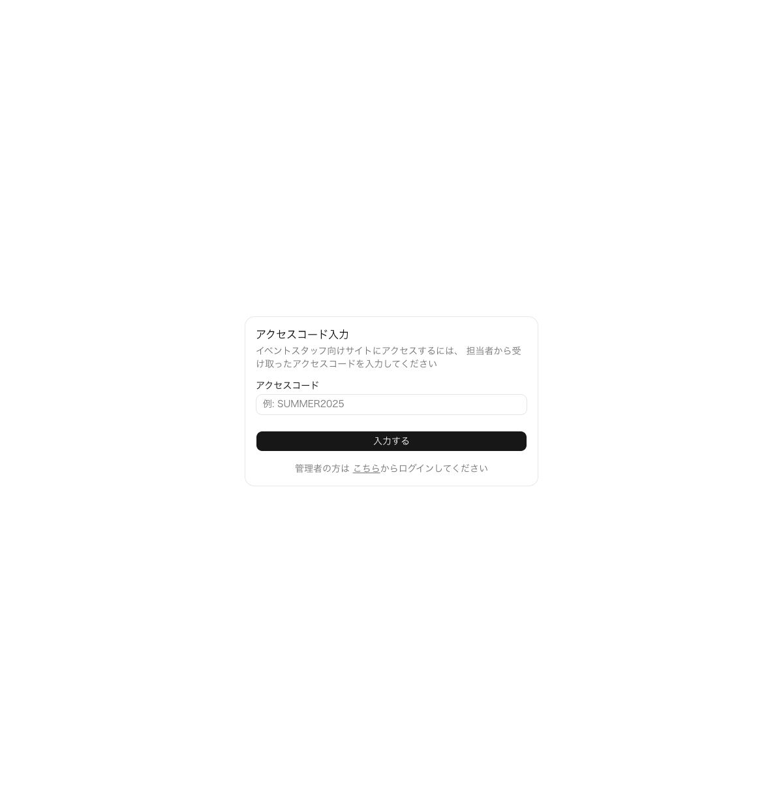
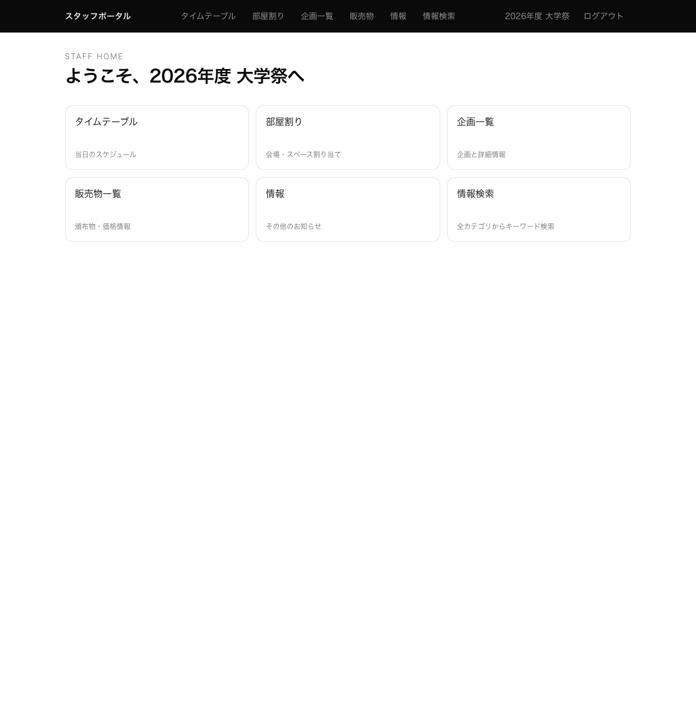
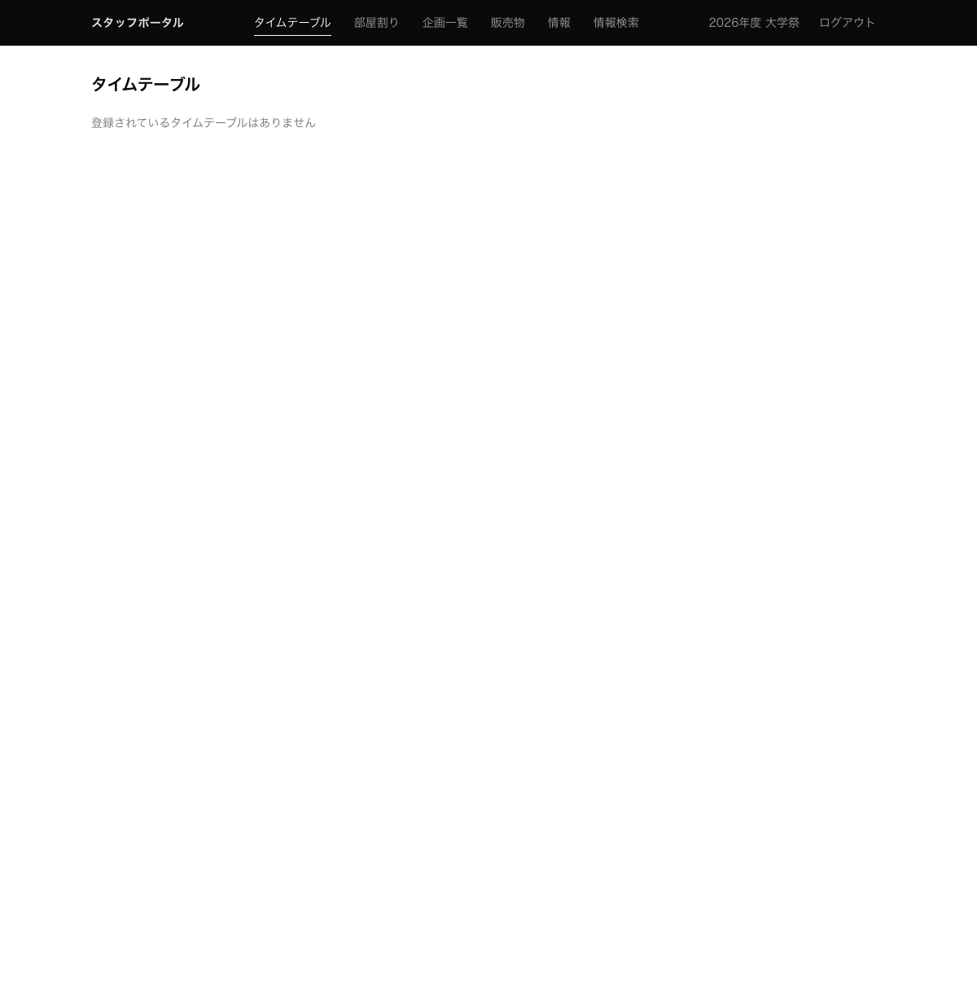
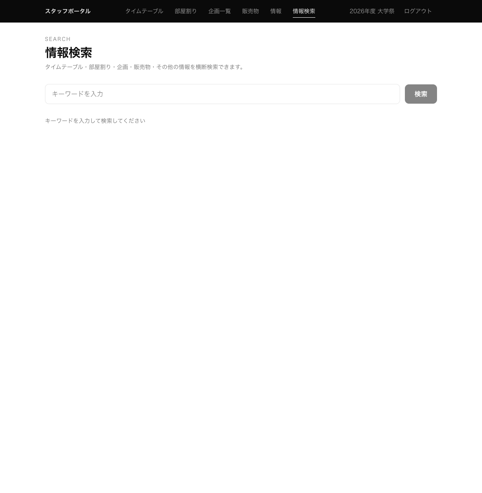

# スタッフ向け利用マニュアル

このマニュアルは、イベントスタッフポータルを利用するスタッフ（一般ユーザー）向けの操作手順を説明します。

---

## 目次

1. [アクセスの開始](#1-アクセスの開始)
2. [ホーム画面](#2-ホーム画面)
3. [タイムテーブル](#3-タイムテーブル)
4. [部屋割り](#4-部屋割り)
5. [企画一覧](#5-企画一覧)
6. [販売物一覧](#6-販売物一覧)
7. [情報（その他）](#7-情報その他)
8. [情報検索](#8-情報検索)
9. [ログアウト](#9-ログアウト)

---

## 1. アクセスの開始

スタッフポータルへのアクセスには、担当者から配布された **アクセスコード** が必要です。

### 手順

1. ブラウザで `https://reitaisai.info/access` にアクセスします
2. アクセスコード入力画面が表示されます

3. 担当者から受け取ったアクセスコードを入力します（例: `FEST2026`）
4. 「入力する」ボタンをクリックします
5. 正しいコードであれば、自動的にホーム画面に遷移します

> **注意:** アクセスコードはイベントごとに発行されます。有効期間外のコードは使用できません。

---

## 2. ホーム画面

アクセスコードを入力すると、ホーム画面が表示されます。

ホーム画面には以下の機能へのリンクが表示されます：

| 機能 | 説明 |
|------|------|
| タイムテーブル | 当日のスケジュール一覧 |
| 部屋割り | 会場・スペース割り当て情報 |
| 企画一覧 | 企画と詳細情報 |
| 販売物一覧 | 頒布物・価格情報 |
| 情報 | その他のお知らせ |
| 情報検索 | 全カテゴリからキーワード検索 |

ナビゲーションバーの右側には現在のイベント名と「ログアウト」ボタンが表示されます。

---

## 3. タイムテーブル

当日のスケジュールを時系列で確認できます。

- 各スケジュールには「タイトル」「開始・終了時刻」「場所」「説明」が表示されます
- 時刻順に並んで表示されます

---

## 4. 部屋割り

会場の部屋割り情報を確認できます。

- 建物名・フロア・部屋名が表示されます
- 前日担当・当日担当の担当部署と用途が確認できます

---

## 5. 企画一覧

イベントの企画情報を確認できます。

- 企画名・場所・開始終了時刻・説明が表示されます
- 時刻順に並んで表示されます

---

## 6. 販売物一覧

頒布物の情報を確認できます。

- 商品名・価格・在庫状況が表示されます
- 在庫状況は「在庫あり」「残りわずか」「売り切れ」の3種類で表示されます

---

## 7. 情報（その他）

注意事項や連絡先など、自由記述のお知らせを確認できます。

---

## 8. 情報検索

タイムテーブル・部屋割り・企画・販売物・その他の情報を横断的にキーワード検索できます。

### 手順

1. 検索ボックスにキーワードを入力します
2. 「検索」ボタンをクリックします
3. 該当する情報がカテゴリ別に表示されます

---

## 9. ログアウト

ナビゲーションバー右上の「ログアウト」ボタンをクリックすると、アクセスコードのセッションが終了しアクセスコード入力画面に戻ります。

---

## よくある質問

**Q: アクセスコードを忘れた場合は？**
A: 担当の管理者に連絡してください。

**Q: 「アクセスコードが無効です」と表示される場合は？**
A: コードの入力ミスか、有効期間外の可能性があります。担当者に確認してください。

**Q: ページが表示されない場合は？**
A: ブラウザを再読み込みするか、アクセスコードを再入力してください。
